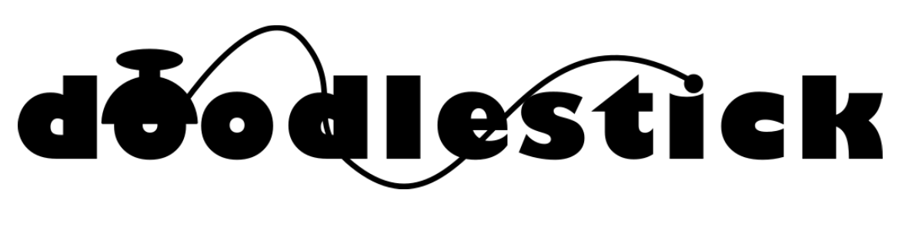
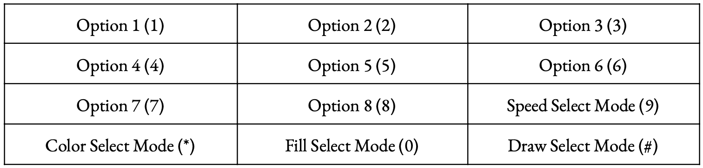
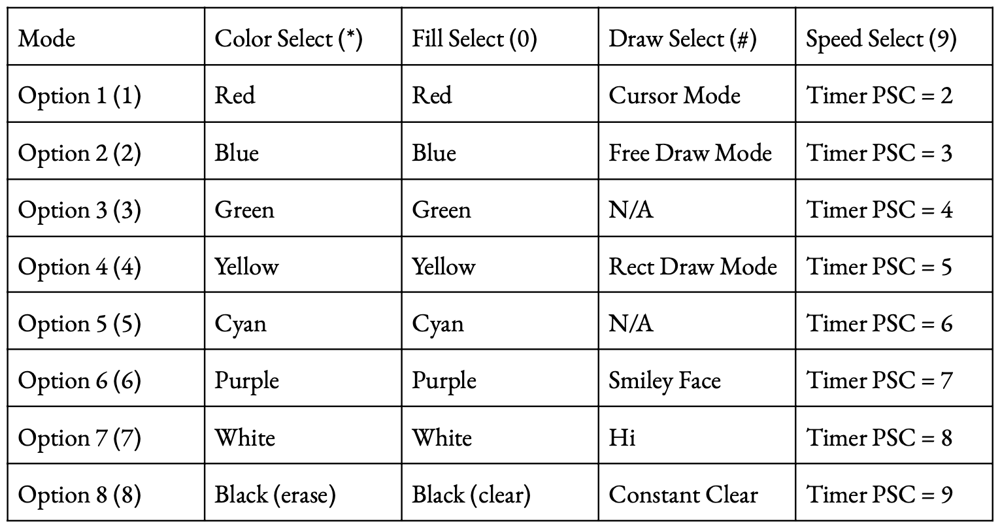
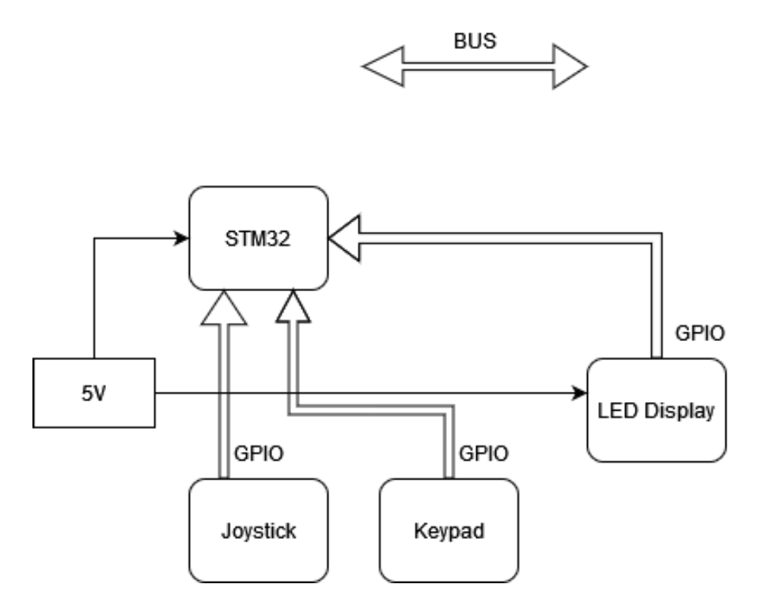
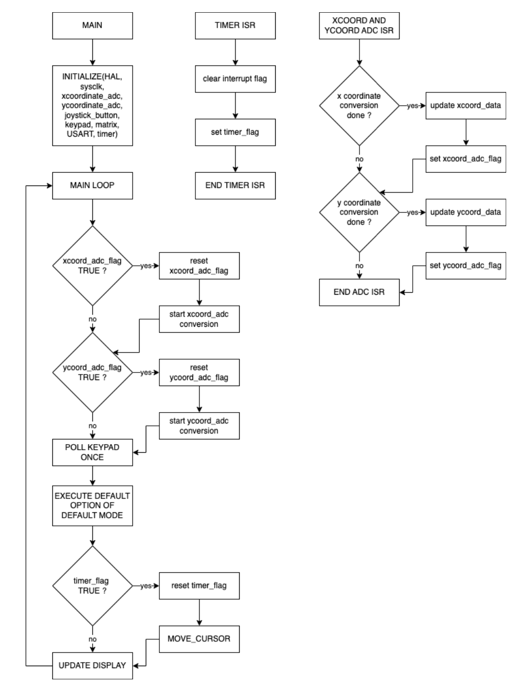
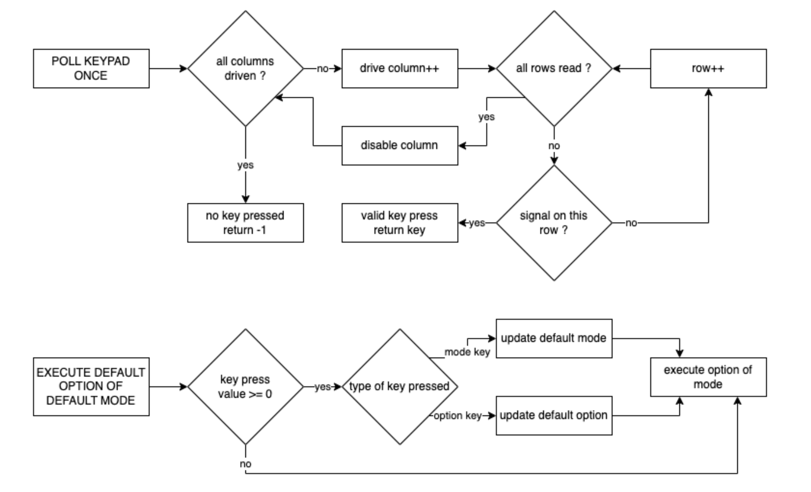
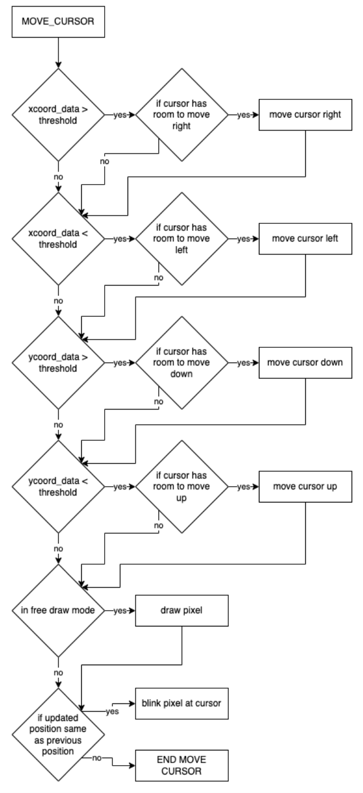
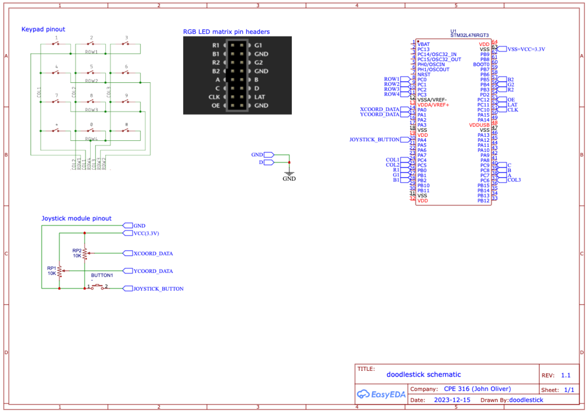
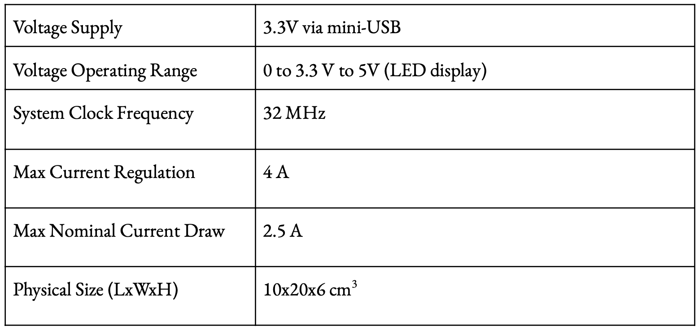

# CPE 316 Final Project: Doodlestick

## Authors
Jack Krammer and Srinivas Sundararaman

December 15, 2023

## Video Demo
A link to the video demo can be found 
<a href="https://docs.python.org/3/library/gc.html" title="demo">here</a>.

## Description
Doodlestick is an STM32L476RG embedded application that allows the manipulation of 
contents on an LED dot matrix display via joystick and keypad inputs. The joystick
is used for position selection and the keypad for mode selection.

### Mode Selection
Allows the user to change between the menu types listed above. By having multiple 
option menus, the amount of user input available is no longer limited to 12 
options (one for each button). Instead, each of the four modes uniquely utilize 
the first eight buttons to achieve a total of thirty-two unique options to select 
from. As there are many available, some of the options associated with these menus 
provide a couple matrix presets as easter eggs. 

**Table 1.** This table identifies the keypad layout and the corresponding mode or option that is selected upon that key press. In parenthesis are the values shown on the keypad itself. The table below describes the options available in each mode.

**Table 2.** This table indicates the option available at each option key for each mode available. This program was designed for one key to be pressed at a time. In order to select the desired option, the mode key must first be pressed, then the desired option key. If the desired option is already within the mode of the previous mode key press, then only the option key press is required to choose that option. The output due to an option selection will not be changed until the next option key press. Pressing one of the mode select keys won’t change the current output.

#### Color Select Mode
Pressing the **(*)** key activates the color select mode. This allows the user to change the stroke color.

#### Fill Select Mode
Pressing the **(0)** key activates the fill select mode. This allows the user to fill the entire LED matrix with the desired color.

#### Draw Select Mode
Pressing the **(#)** key activates the draw select mode. This allows the user to change the functionality of the cursor. In **cursor mode** (option 1), the user can move the current position on the display without drawing over coordinates that the cursor passes through. In **free draw** mode (option 2), the user can move the current position on the display while drawing over coordinates that the cursor passes through based on the selected color. To not draw over coordinates, use **cursor mode**. In **rect draw mode** (option 4), the user can draw rectangles. It initially acts as **cursor mode**, allowing you to move to any coordinate, but by pressing down the joy-stick at two coordinates, a rectangle with a diagonal at said two LED coordinates is rasterized with the selected color. There are other easter eggs associated with options of this mode.

#### Speed Select Mode
Pressing the **(9)** key activates the speed select mode. This allows the user to change the speed of the cursor. In other words, the joystick input is read at a faster or slower rate. *Note: As a visual aid, the rate of the blinking cursor is proportional to the stroke sensitivity.*

## Software Design

### Software Architecture

**Figure 1.** The figure above is the overall system architecture for doodlestick. The LED matrix display needs more power than the STM32 can provide, so a 5V adapter was used to interface the peripheral.

### Software Flowcharts

**Figure 2.** The figure above is the main and ISR software flowcharts. These flowcharts rely on the global variables matrix_buffer, timer_flag, cursor_position, xcoord_adc_flag, xcoord_data, ycoord_adc_flag, ycoord_data. The execute option function block represents the case statement that decides the action performed on the matrix_buffer. Later in the main function, the update display function writes the matrix_buffer to the LED matrix. The timer_flag variable is used to indicate when the cursor position should be updated. The x and y coordinate flags and associated data indicate when another ADC conversion should be started and stores the latest conversion result to be used when moving the cursor. 

**Figure 3.** The figure above is the keypad and command execution software flowcharts. The keypad is used to get the user’s desired option selection. The return value of -1 when a key isn’t pressed indicates that the current selection shouldn’t change. Otherwise, when a key is pressed, the associated key value is used to update the mode or option selected. These updated values are then stored and treated as the new defaults until another key is pressed.

**Figure 4.** The figure above is the cursor movement software flowchart. This function is called every time the timer_flag is set. Due to some variability in the values representing the neutral x and y positions, there is a threshold the user must move the joystick past in order to enact a change in position. This function separately checks the x and y coordinates, enabling diagonal movement. This function also separately checks both directions of both axis directions in order to have the cursor position be as responsive as possible. This function also controls the blinking of the cursor when the cursor position does not change. A static variable is incremented each time this function is accessed and changes the blink state every multiple of the blink threshold defined in main. This ensures the blink can happen at a rate slow enough for the eye to see.

## Hardware Design

### System Schematics

**Figure 5.** This is the schematic for the doodlestick system. The netport labels indicate where the pins are connected. For all the row and col pins of the keypad, standard GPIO input and output modes were used. For the joystick module, separate ADCs were configured on the X and Y coordinate data pins. To keep the voltages inputted to the ADCs within the proper range, the voltage source pin of the joystick was connected to the 3.3V pin. The joystick button was configured as a GPIO input pin with a pull up resistor. For the RGB module, the control pins were configured as standard GPIO outputs and connected as shown above. The power to this module came from a separate 5V 4A DC power source. 

### System Specifications

**Table 3.** This table identify the system specifications.

## Ethical Implications
One ethical implication needed to be considered is the extra current that the rather large LED dot matrix needs in order to keep color values on the screen, or else the LEDs won’t get driven. This means there’s extra power consumption to consider, and whether this application is worth enough to outweigh the miniscule but non-trivial increase in the user’s footprint. Another consideration is the tradeoff between ease of programming and testing over efficiency and less power usage. For example, this sys ended up using polling for a vast majority of the I/O in order to function. However, extra checks, reads and writes that are unnecessary also increases the energy consumption, which has the same problem as the last ethical implication. 

